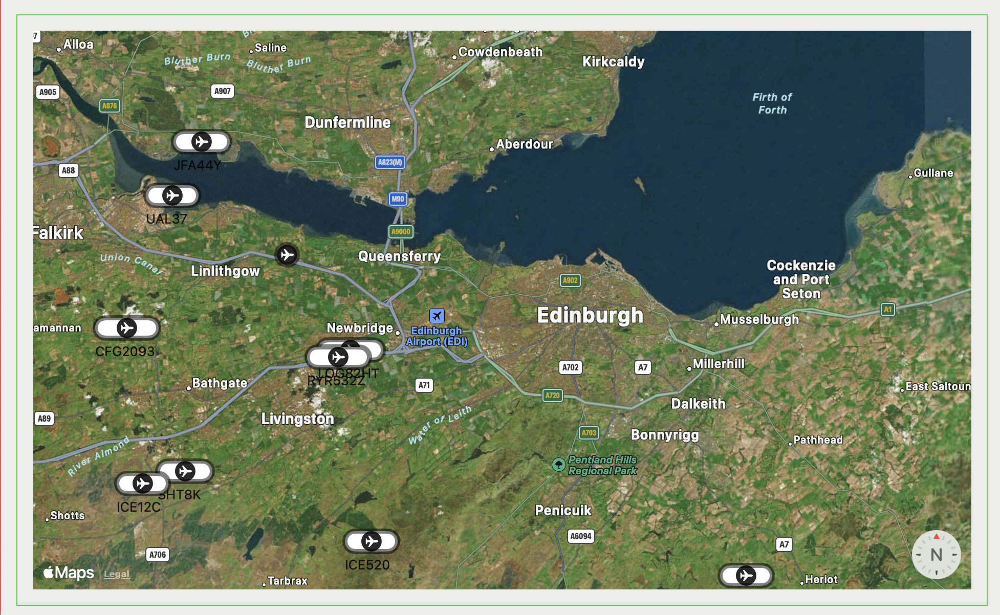

# ADSB Decoder

ADSB Decoder http://main.lv/writeup/adsb_decoder.md

Github mirror of the project

* This is not development repository
* No support
* Macos only
* Source only relase
* Please Issue tracker only for issues

V0.1
Docs [ADSBDecoder doc](docs/ADSBDecoder_0.1.pdf)

* Fixed drawing of airplanes, now they updated when new data comes in
* Cleaned up unused buttons and not fully implemented menus

V0.0.9
Docs [ADSBDecoder doc](docs/ADSBDecoder_0.0.9.pdf)

* Load from file and reply ADSB messages
* Connect to dump1090 tcp server and get data
* Live data on map
